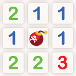
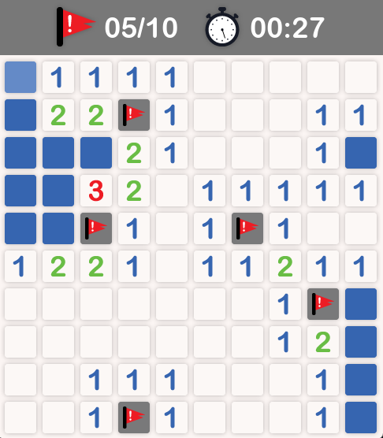
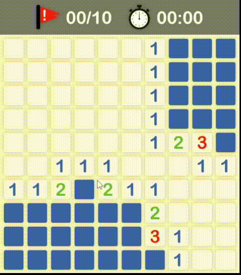
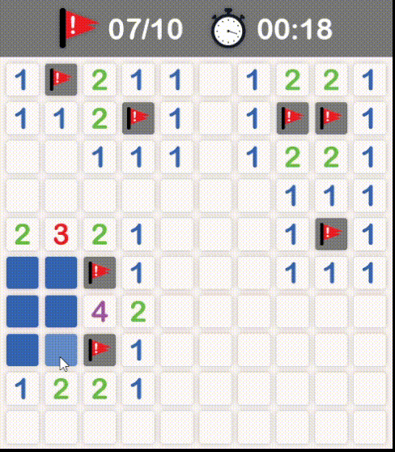

# Mine Sweeper Clone

<!-- PROJECT LOGO -->
 

  

<h3 align="center">Mine Sweeper Clone</h3>

  

    A python clone of the classic puzzle video game, Mine Sweeper!
     
    <a href="https://github.com/djsereno/Mine-Sweeper"><strong>Explore the docs »</strong></a>
     
    <a href="https://github.com/djsereno/Mine-Sweeper/issues">Report Bug</a>
    ·
    <a href="https://github.com/djsereno/Mine-Sweeper/issues">Request Feature</a>
  

<!-- TABLE OF CONTENTS -->

  
Table of Contents

  <ol>
    <li>
      <a href="#about-the-project">About The Project</a>
      <ul>
        <li><a href="#built-with">Built With</a></li>
      </ul>
    </li>
    <li><a href="#installation">Installation</a></li>
    <li><a href="#usage">Usage</a></li>
      <ul>
        <li><a href="#controls">Controls</a></li>
        <li><a href="#gameplay">Gameplay</a></li>
      </ul>
    <li><a href="#roadmap">Roadmap</a></li>
    <li><a href="#contributing">Contributing</a></li>
    <li><a href="#contact">Contact</a></li>
    <li><a href="#acknowledgments">Acknowledgments</a></li>
  </ol>

<!-- ABOUT THE PROJECT -->

## About The Project

    

Minesweeper is a single-player puzzle video game. The objective of the game is to clear a rectangular board containing hidden "mines" or bombs without detonating any of them, with help from clues about the number of neighboring mines in each field.

(<a href="#top">back to top</a>)

### Built With

* [Python](https://www.python.org/)
* [PyGame](https://www.pygame.org/)

(<a href="#top">back to top</a>)

<!-- GETTING STARTED -->

## Installation

1. Download the [Minesweeper.zip](https://github.com/djsereno/Mine-Sweeper/blob/main/Minesweeper.zip) file.
2. Extract the contents to a new folder.
3. Run the `minesweeper.exe` file.
    - Note: The `minesweeper.exe` file and `assets` folder must be contained within the same folder to work.

(<a href="#top">back to top</a>)

<!-- USAGE EXAMPLES -->

## Usage

### Controls

* `Left-click` a cell to open it. 
* `Right-click` a cell to flag/unflag it as a mine. 
* `Middle-click` a cell to flag/unflag it as unknown. 

### Gameplay

* The game begins on the first click on the board.
* If the opened cell contains a mine, the game ends. 

    

* If the opened cell does not contain a mine, the number of adjacenet mines (horizontally, vertically, and diagonally) will be revealed.
    * If no adjacent mines, the tile will be blank, and all adjacent non-mined cells will automatically be opened.
* Use the information given from the opened cells to deduce further cells that are safe to open, iteratively gaining more information to solve the board.
* To win the game, you must open all non-mine cells while not opening any mines. Flagging all the mined cells is not required.

    

* The "score" of the game is the time taken to complete it. The timer starts when the player makes their first click and ends when they make their last click. 

(<a href="#top">back to top</a>)

<!-- ROADMAP -->

## Roadmap

- [ ] Settings menu
    - [ ] Difficulty adjustment
    - [ ] Sound effects volume control/mute
- [ ] Leaderboard implementation
- [ ] Animations
    - [ ] Empty cell cascades
    - [ ] Tripped mine cascades
    - [ ] Flags placed/removed

See the [open issues](https://github.com/djsereno/Mine-Sweeper/issues) for a full list of proposed features (and known issues).

(<a href="#top">back to top</a>)

<!-- CONTRIBUTING -->

## Contributing

If you have a suggestion that would make this better, please fork the repo and create a pull request. You can also simply open an issue with the tag "enhancement".
Don't forget to give the project a star! Thanks again!

1. Fork the Project
2. Create your Feature Branch (`git checkout -b feature/AmazingFeature`)
3. Commit your Changes (`git commit -m 'Add some AmazingFeature'`)
4. Push to the Branch (`git push origin feature/AmazingFeature`)
5. Open a Pull Request

(<a href="#top">back to top</a>)

<!-- CONTACT -->

## Contact

Derek Sereno - [LinkedIn](https://www.linkedin.com/in/dereksereno/) - [Email](mailto:djsereno91@gmail.com)

Project Link: [https://github.com/djsereno/Mine-Sweeper](https://github.com/djsereno/Mine-Sweeper)

(<a href="#top">back to top</a>)

<!-- ACKNOWLEDGMENTS -->

## Acknowledgments

- Images courtesy of [vecteezy.com](https://www.vecteezy.com)
- Audio curtesy of [freesound.org](https://freesound.org) & [mixkit.co](https://mixkit.co)

(<a href="#top">back to top</a>)
